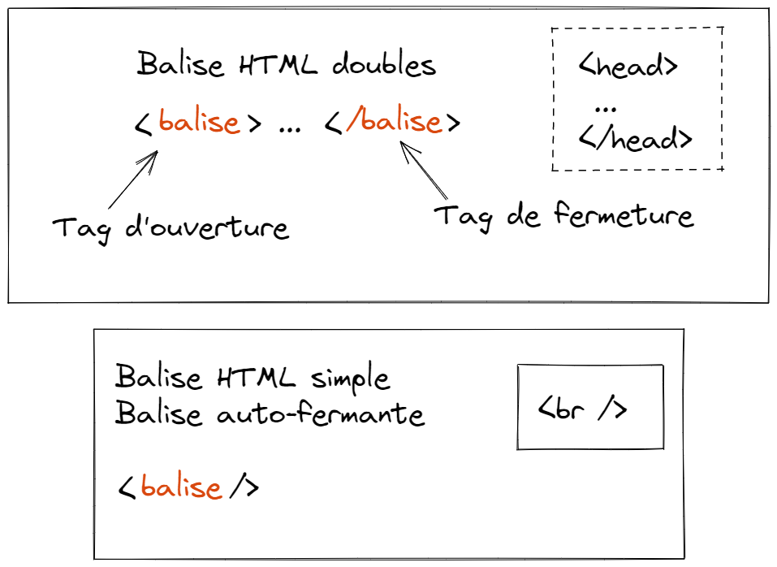
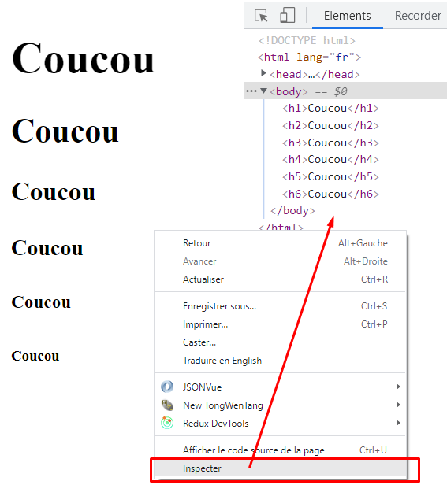

# STUDI - HTML/CSS

## Introduction

**HTML** = HyperText Markup Language

### La communication client / serveur


Le **client**, un navigateur web, va communiquer avec un **serveur** via le protocole **HTTP**.

Le serveur, en réponse, va lui envoyer une réponse **HTML**.

Cette réponse peut être issue d'un document HTML **statique**, tel que ceux que nous allons réaliser ensemble tout au long de ce module, ou bien issue d'une application web plus complexe, et plus **dynamique** : dans ce cas, la réponse est adaptée au contexte dans lequel on se trouve (si je suis connecté, alors je vois _mon feed_ et pas celui d'un autre...).

### Le contenu HTML

Sur n'importe quel site, vous pouvez consulter le code HTML de la page, en faisant un clic droit n'importe où sur la page et en cliquant sur "Inspecter".

> Vous pouvez également utiliser la touche _F12_ pour ouvrir l'inspecteur d'éléments, sous Windows, ou encore _Command+Shift+C_ sur Mac

Sur toutes les pages qu'on va visiter, nous aurons au minimum cette **structure** dans les outils de développement (inspecteur d'éléments) :

```html
<!DOCTYPE html>
<html>
  <head></head>
  <body></body>
</html>
```

> Le contenu HTML d'une page représente sa structure, c'est-à-dire l'ensemble des éléments qui composent la page

### Votre premier fichier HTML

Pour pouvoir créer et éditer votre premier fichier HTML, vous allez installer un **IDE** : Integrated Development Environment.

Dans ce module, j'utiliserai [Visual Studio Code](https://code.visualstudio.com/).

Vous pouvez reprendre le [replay du live n°1](https://app.studi.fr/#/dashboard/events/26365/replay) pour avoir les détails d'installation et de configuration, ainsi que les extensions à installer.

Dans Visual Studio Code, on va ouvrir un dossier en passant par le menu ou en utilisant le raccourci _Ctrl+K Ctrl+O_.

Le fait d'ouvrir un dossier nous permet de nous placer dans un **environnement de travail**. C'est dans ce dossier qu'on pourra créer nos différents fichiers.

Une fois dans ce dossier, on va créer un fichier `index.html`, et y inscrire ce contenu :

```html
<!DOCTYPE html>
<html lang="fr">
  <head></head>
  <body>
    Coucou
  </body>
</html>
```

Ensuite, on va se rendre dans un navigateur, puis ouvrir ce fichier directement avec le raccourci _Ctrl+O_.

On doit normalement voir apparaître "Coucou" à l'écran.

## Structure des balises HTML

Lors de la réalisation de nos maquettes HTML, nous utiliserons 2 types de balises :

- Les balises doubles
- Les balises simples (ou auto-fermantes)

### Balises doubles

La structure est très simple :

```html
<balise> ... </balise>
```

Le principe est d'avoir un "tag" d'ouverture et un autre de fermeture. Ainsi, on peut y inscrire du contenu supplémentaire.

Exemple :

```html
<head>
  <title>Le titre de ma page qui s'affichera dans l'onglet</title>
</head>
```

Ici, nous avons utilisé 2 balises doubles : les balises `head` et `title`.

### Balises simples (ou auto-fermantes)

La syntaxe est légèrement différente, mais très simple à retenir :

```html
<balise />
```

Pour le moment nous n'en avons pas encore utilisé concrètement, mais nous en verrons plusieurs.

A titre d'exemple, tout de même, si vous voulez faire un retour à la ligne dans une page, vous pouvez utiliser la balise `br` :

```html
<br />
```

Une petite note supplémentaire sur la syntaxe des balises simples : ça fonctionne aussi sans le `/`, donc sous la forme `<balise>`. Mais personnellement, j'utilise beaucoup plus souvent la syntaxe avec le `/` pour l'auto-fermeture.



> Important : chaque balise HTML a un rôle précis, on n'utilise pas les balises au hasard. On vient de découvrir, notamment, que la balise `title` sert à définir le titre de la page, qui apparaîtra dans l'onglet du navigateur par exemple. Ou encore `br`, qui est une balise simple, pour faire un retour à la ligne

## L'inspecteur d'éléments

Dans votre navigateur, vous pouvez **inspecter** le contenu de la page que vous avez à l'écran. En gros, vous pouvez explorer son code source (et son CSS, on le verra plus tard) :



Vous pouvez également modifier le code se trouvant dans la partie "Elements".

> Attention, si vous réalisez un changement, cela ne signifie pas que vous avez modifié le site, vous avez seulement changé l'apparence dans votre navigateur, donc pour vous uniquement. Si je change "Coucou" en un autre texte, cela n'aura pas modifié mon fichier dans VSCode

## Le cache du navigateur

Le cache du navigateur permet au navigateur, quand il affiche une page, de stocker les fichiers (images, CSS, etc...) associés à cette page. Ainsi, si vous souhaitez consulter la même page un peu plus tard, il n'est pas obligé d'aller demander au serveur, il peut vous afficher de nouveau la même page.

> Pensez, quand vous voulez faire des changements dans votre page HTML et que vous l'avez correctement enregistré dans VSCode, à rafraîchir avec le raccourci `Ctrl+R` ou `Ctrl+Shift+R` au lieu de `F5`. Cela est censé vider le cache pour la page que vous voulez rafraîchir

## Les balises `head` et `body`

Les balises `head` et `body` sont **indispensables** dans toute page web.

Elles se trouvent toutes les deux en-dessous de la balise **racine**, la balise `html`.

- La balise `head` permet de décrire au navigateur les **métadonnées** concernant la page qu'on souhaite afficher. Par exemple, quand on utilise la balise `title`, alors on doit l'inscrire dans la balise `head` et pas ailleurs. Son rôle est d'indiquer au navigateur le titre de la page. Mais ce titre n'est pas forcément celui qui apparaîtra dans la page. En l'occurence, on voit que le navigateur s'en sert pour l'afficher dans l'onglet

- La balise `body`, comme son nom l'indique, représente le **corps** de la page : c'est ce qu'on va voir à l'écran

## Les balises de titres

Les balises de `h1` à `h6` permettent, dans le body, d'indiquer au navigateur des titres d'importances variées. Le niveau 1 sera le plus important, on essayera donc de n'avoir qu'une seule balise `h1` sur notre page. Les niveaux de 1 à 6 vont du plus important au moins important.
