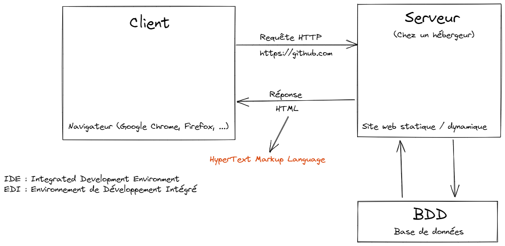

# STUDI - HTML/CSS

## Introduction

**HTML** = HyperText Markup Language

### La communication client / serveur



Le **client**, un navigateur web, va communiquer avec un **serveur** via le protocole **HTTP**.

Le serveur, en réponse, va lui envoyer une réponse **HTML**.

Cette réponse peut être issue d'un document HTML **statique**, tel que ceux que nous allons réaliser ensemble tout au long de ce module, ou bien issue d'une application web plus complexe, et plus **dynamique** : dans ce cas, la réponse est adaptée au contexte dans lequel on se trouve (si je suis connecté, alors je vois _mon feed_ et pas celui d'un autre...).

### Le contenu HTML

Sur n'importe quel site, vous pouvez consulter le code HTML de la page, en faisant un clic droit n'importe où sur la page et en cliquant sur "Inspecter".

> Vous pouvez également utiliser la touche _F12_ pour ouvrir l'inspecteur d'éléments, sous Windows, ou encore _Command+Shift+C_ sur Mac

Sur toutes les pages qu'on va visiter, nous aurons au minimum cette **structure** dans les outils de développement (inspecteur d'éléments) :

```html
<!DOCTYPE html>
<html>
  <head></head>
  <body></body>
</html>
```

> Le contenu HTML d'une page représente sa structure, c'est-à-dire l'ensemble des éléments qui composent la page

### Votre premier fichier HTML

Pour pouvoir créer et éditer votre premier fichier HTML, vous allez installer un **IDE** : Integrated Development Environment.

Dans ce module, j'utiliserai [Visual Studio Code](https://code.visualstudio.com/).

Vous pouvez reprendre le [replay du live n°1](https://app.studi.fr/#/dashboard/events/26365/replay) pour avoir les détails d'installation et de configuration, ainsi que les extensions à installer.

Dans Visual Studio Code, on va ouvrir un dossier en passant par le menu ou en utilisant le raccourci _Ctrl+K Ctrl+O_.

Le fait d'ouvrir un dossier nous permet de nous placer dans un **environnement de travail**. C'est dans ce dossier qu'on pourra créer nos différents fichiers.

Une fois dans ce dossier, on va créer un fichier `index.html`, et y inscrire ce contenu :

```html
<!DOCTYPE html>
<html lang="fr">
  <head></head>
  <body>
    Coucou
  </body>
</html>
```

Ensuite, on va se rendre dans un navigateur, puis ouvrir ce fichier directement avec le raccourci _Ctrl+O_.

On doit normalement voir apparaître "Coucou" à l'écran.
